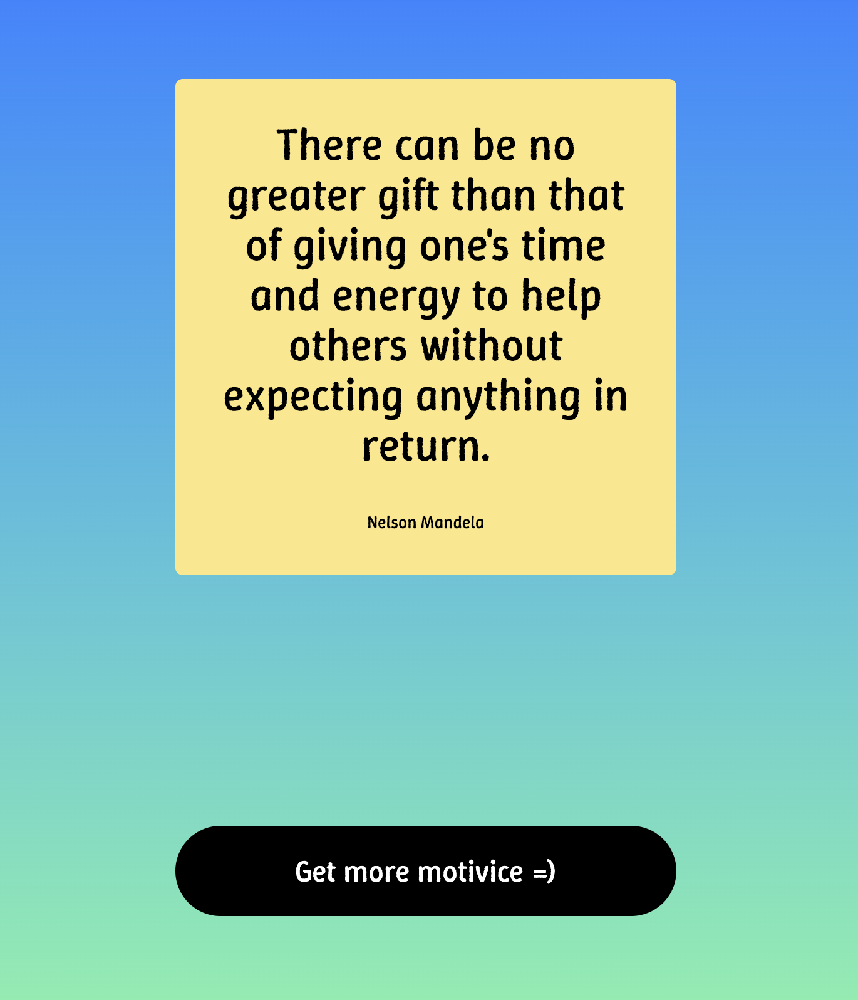

# Motivice

Motivice is a simple fullstack app that delivers motivational advice for everyone, every day.

## Preview



## Features

- Get a random motivational quote with a single click
- Clean, minimalist UI
- Powered by a Node.js backend and a modern React frontend

## How it works

- The frontend fetches motivational quotes from the backend API
- Each click provides a new piece of advice to inspire your day

## Getting Started

1. **Install dependencies**

   - Frontend: `cd motivice && pnpm install`
   - Backend: `cd motivice-be && pnpm install`

2. **Run the app locally**

   - Backend: `cd motivice-be && pnpm start`
   - Frontend: `cd motivice && pnpm dev`

3. **Open your browser**
   - Visit `http://localhost:5173` (or the port shown in your terminal)

## Project Structure

```
motivice-app/
  motivice/      # Frontend (React + Vite)
  motivice-be/   # Backend (Node.js)
```

## Motivation

Motivice was created to bring a daily dose of positivity and motivation to everyone, in a beautifully simple way.

---

Enjoy your motivice! ✨
